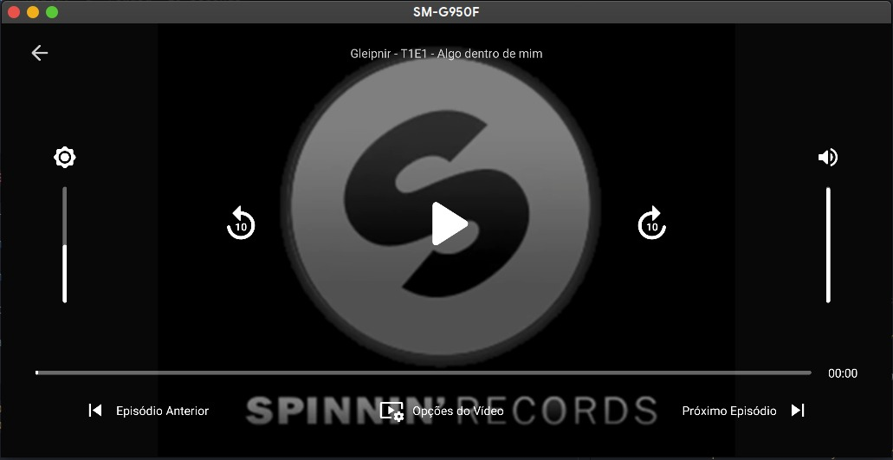

# Video Player

## TODO

- [x] `Play` a local/external video
- [x] `Play` & `Pause` video
- [x] `Replay` & `Foward` 10 seconds
- [ ] Change video `Volume`
  - [ ] Change with `Gestures`
- [ ] Change screen `Brightness`
  - [ ] Change with `Gestures`
- [ ] Go to `Next` & `Previous` video
- [ ] Change video `Options`
  - [ ] `Caption`
  - [ ] `Resolution`
  - [ ] `Crop Mode`

## Getting Started

- Clone this repository
  - `git clone https://github.com/jarthursantos/react-cookbook`
- Enter in `recipe` folder
  - `cd react-cookbook/native/video-player`
- Install all depencecies
  - `npm install` or `yarn` *(recommended)*
- Start JS Server
  - `npm run start` or `yarn start` *(recommended)*
- Launch the application in your device
  - `npm run android` or `yarn android` *(recommended)*
  - `npm run ios` or `yarn ios` *(recommended)*

**note, if you are using iOS, you need execute additionals following steps, enter in all depencecies and execute the required steps**
